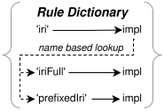

# Create Transformer

Transformations in Traqula exist on two levels:

1. **AST tree transformers** (`TransformerObject`, `TransformerTyped`, `TransformerSubTyped`):
   These iterate any tree following the format `{ type: string, subType?: string }` and are discussed under [the AST structure docs](../usage/AST-structure.md).
   They work well for simple, localized AST manipulations — for example, capitalizing all string literals or collecting all variables.

2. **Indirection-based transformer pipelines** (`IndirBuilder` + `IndirDef`):
   More complex transformations can be constructed as a flow of function calls in a modular fashion using the same indirection mechanism used for the parser and generator builders.
   This is the approach used by Traqula's [algebra transformers](../../packages/algebra-transformations-1-1) to convert a SPARQL AST into SPARQL Algebra.



The rest of this document focuses on creating an indirection-based transformer pipeline.

## Indirection Definition

Similar to `ParserRule` and `GeneratorRule`, a transformer pipeline uses `IndirDef` exposed by `@traqula/core`.
An `IndirDef` has a `name` and a `fun` function.
The `fun` function receives helper utilities (currently just `SUBRULE` for calling other definitions)
and returns the actual implementation, which receives a context and optional parameters:

```typescript
import { type IndirDef } from '@traqula/core';
type Context = {};

const ruleReturningOne: IndirDef<Context, 'returningOne', 1> = {
  name: 'returningOne',
  fun: () => () => 1,
};

// -----------------------   Context   -   Name    -   ReturnType - Arguments
const ruleAddingOne: IndirDef<Context, 'addingOne', number, [ number ]> = {
  name: 'addingOne',
  fun: ({ SUBRULE }) => (C, otherNumber) => {
    return otherNumber + SUBRULE(ruleReturningOne);
  },
};
```

> [!important]
> Always provide explicit type parameters for your `IndirDef` definitions.
> See the [guidelines](../guidelines.md) for more details on typing rules.

When using `SUBRULE`, the call is resolved at runtime to whatever definition is _currently registered_ under that name.
This means that if someone later patches `ruleReturningOne`, all callers automatically use the new implementation — this is the key to modularity.

## Building a Transformer

These definitions are grouped together and managed using the `IndirBuilder` of `@traqula/core`:

```typescript
import { IndirBuilder } from '@traqula/core';
const indirBuilder = IndirBuilder
  .create(<const> [ruleReturningOne, ruleAddingOne]);
const transformer = indirBuilder.build();

// Call any registered function by name:
// ------   context - args
const five = transformer.addingOne({}, 4);
```

The `IndirBuilder` supports the same manipulation methods as `ParserBuilder` and `GeneratorBuilder`:

| Method | Purpose |
|--------|---------|
| `IndirBuilder.create(rules \| existingBuilder)` | Create from rules array or copy an existing builder |
| `.addRule(rule)` | Add a new definition (TypeScript errors on name conflict) |
| `.addMany(rule1, rule2, ...)` | Add multiple definitions at once |
| `.patchRule(rule)` | Replace the implementation of an existing definition |
| `.deleteRule(name)` | Remove a definition by name |
| `.deleteMany(name1, name2, ...)` | Remove multiple definitions |
| `.getRule(name)` | Retrieve a definition for inspection or wrapping |
| `.widenContext()` | Narrow the context type parameter |
| `.typePatch<{...}>()` | Update type signatures without changing implementations |
| `.merge(otherBuilder, overrides)` | Merge two builders, resolving conflicts with overrides |
| `.build()` | Build the final callable transformer object |

## Practical Example

Below is a simplified example showing how you might build a transformer that converts
part of a SPARQL-like AST into a different representation:

```typescript
import { type IndirDef, IndirBuilder } from '@traqula/core';

// Context carries shared state through the transformation
interface TransformContext {
  prefixes: Map<string, string>;
}

// Each IndirDef handles one aspect of the transformation
const translateQuery: IndirDef<TransformContext, 'translateQuery', AlgebraQuery, [QueryAST]> = {
  name: 'translateQuery',
  fun: ({ SUBRULE }) => (ctx, query) => {
    // Collect prefixes into context
    for (const prefix of query.context) {
      ctx.prefixes.set(prefix.prefix, prefix.iri.value);
    }
    // Delegate to another rule for the body
    const body = SUBRULE(translatePattern, query.where);
    return { type: 'query', body };
  },
};

const translatePattern: IndirDef<TransformContext, 'translatePattern', AlgebraOp, [PatternAST]> = {
  name: 'translatePattern',
  fun: ({ SUBRULE }) => (ctx, pattern) => {
    // Transform pattern to algebra
    return { type: 'bgp', triples: pattern.triples };
  },
};

// Build and use:
const algebraBuilder = IndirBuilder.create(<const> [translateQuery, translatePattern]);
const toAlgebra = algebraBuilder.build();

const result = toAlgebra.translateQuery({ prefixes: new Map() }, myQueryAST);
```

For a complete, real-world example, see the [SPARQL algebra transformer](../../packages/algebra-transformations-1-1/lib/toAlgebra.ts).
